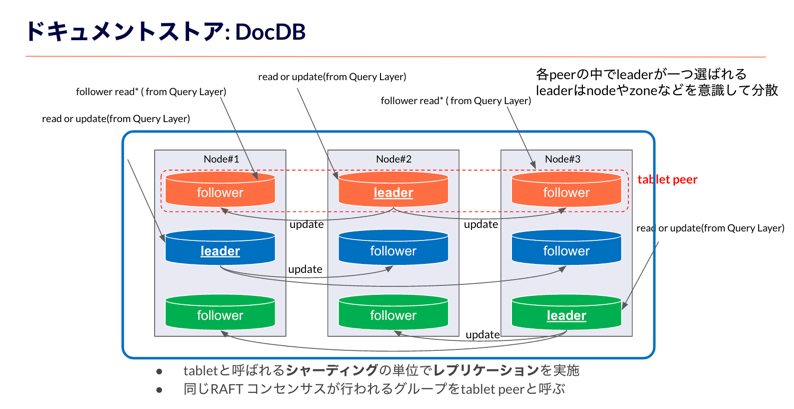
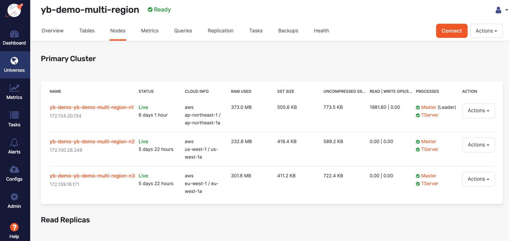
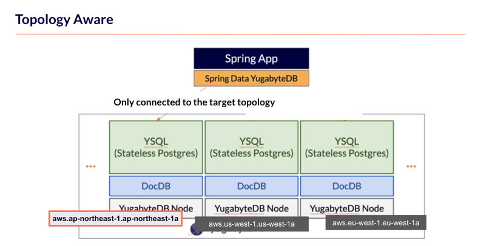
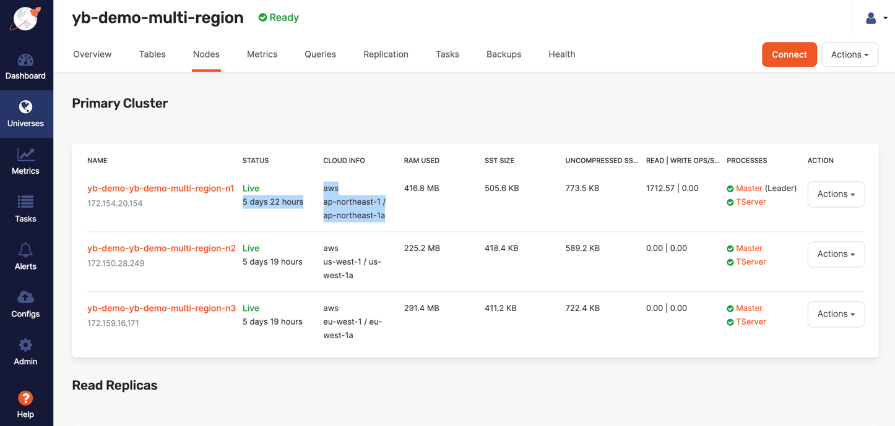

# YSQL Smart Driver Example


## Demo

### Prerequirement

- YugabyteDBのインストール

```bash
% ysqlsh --version
psql (PostgreSQL) 11.2-YB-2.11.2.0-b0
% yb-admin --version
version 2.11.2.0 build 89 revision d142556567b5e1c83ea5c915ec7b9964492b2321 build_type RELEASE built at 25 Jan 2022 18:31:12 GMT
```

- YugabyteDBの起動 (3 node clusterを起動)

```bash
yb-ctl create --rf 3
```

- YugabyteDBデータノードの追加
```bash
yb-ctl add_node
```

[NOTES] --masterオプションをつけることで、masterノードの追加となります。


### ローカルでの接続 
`UniformLoadBalanceAppLocal`

JDBC DriverConfig.getConnection()を使って、ローカルのYugabyteDBインスタンスに接続 (`UniformLoadBalanceAppLocal`)

- Load Balancer機能なし

```
String yburl = "jdbc:yugabytedb://127.0.0.1:5433/yugabyte?user=yugabyte"; // Direct to server
```

```bash
%  mvn -q package exec:java -DskipTests -Dexec.mainClass=com.yugabyte.UniformLoadBalanceAppLocal
Create Connection to YugabyteDB.
Connected to: 127.0.0.1
Connected to: 127.0.0.1
Connected to: 127.0.0.1
Connected to: 127.0.0.1
Connected to: 127.0.0.1
Connected to: 127.0.0.1
```

- Load Balancer機能あり(`load-balance=true`)

```
String yburl = "jdbc:yugabytedb://127.0.0.1:5433/yugabyte?user=yugabyte&load-balance=true";
```

```bash
%  mvn -q package exec:java -DskipTests -Dexec.mainClass=com.yugabyte.UniformLoadBalanceAppLocal
Create Connection to YugabyteDB.
Connected to: 127.0.0.1
Connected to: 127.0.0.3
Connected to: 127.0.0.2
Connected to: 127.0.0.2
Connected to: 127.0.0.1
Connected to: 127.0.0.3
Current load on all servers
-------------------
127.0.0.3 - 2
127.0.0.2 - 2
127.0.0.1 - 2
```
or run no IDE.

- nodeを追加してみる

```bash
% yb-ctl add_node
Adding node.
Waiting for cluster to be ready.
----------------------------------------------------------------------------------------------------
| Node 4: yb-tserver (pid 22676)                                                                   |
----------------------------------------------------------------------------------------------------
| JDBC                : jdbc:postgresql://127.0.0.4:5433/yugabyte                                  |
| YSQL Shell          : /opt/yugabyte-2.11.2.0/bin/ysqlsh -h 127.0.0.4                             |
| YCQL Shell          : /opt/yugabyte-2.11.2.0/bin/ycqlsh 127.0.0.4                                |
| YEDIS Shell         : /opt/yugabyte-2.11.2.0/bin/redis-cli -h 127.0.0.4                          |
| data-dir[0]         : /Users/tichimura/yugabyte-data/node-4/disk-1/yb-data                       |
| yb-tserver Logs     : /Users/tichimura/yugabyte-data/node-4/disk-1/yb-data/tserver/logs          |
----------------------------------------------------------------------------------------------------
```

- 再度、Load Balancerありで接続

```bash
%  mvn -q package exec:java -DskipTests -Dexec.mainClass=com.yugabyte.UniformLoadBalanceAppLocal
Create Connection to YugabyteDB.
Connected to: 127.0.0.1
Connected to: 127.0.0.4
Connected to: 127.0.0.2
Connected to: 127.0.0.3
Connected to: 127.0.0.1
Connected to: 127.0.0.3
Current load on all servers
-------------------
127.0.0.4 - 
127.0.0.3 - 2
127.0.0.2 - 1
127.0.0.1 - 2
```

### Follower Read
`UniformLoadBalanceAppToAWS`



- ノードが分散されると、ノード間のデータ転送に時間がかかるが、一貫性確保のために`leader`から読み込みを行うのが、YugabyteDBのデフォルトの動作
- 一貫性より速さを重要視する場合は、`follower read`と呼ばれる機能により Queryを処理するノード内に、`follower`のデータがあれば、そちらをデータを参照するようにする

[Note]
- `set yb_read_from_followers=true`を設定する
- `setAutoCommit(false)`にする
- `START TRANSACTION READ ONLY`を設定する
- (connectionもsetReadOnlyになっている)

[Demo]
- コードの変更
```
    Connection conn = DriverManager.getConnection(yburl);
    Statement stmt = conn.createStatement();
    stmt.execute("set yb_read_from_followers=true");
    stmt.execute("START TRANSACTION READ ONLY");
```

- 実行
```
% mvn -q package exec:java -DskipTests -Dexec.mainClass=com.yugabyte.UniformLoadBalanceAppToAWS
Create Connection to YugabyteDB.
13.230.214.41
```

- ダッシュボードで確認　(ここでは、Yugabyte Platformを利用してます)



### Topology Aware 
`TopologyAwareLoadBalanceApp`



- 接続情報の変更

```
        String dbhost = "YOUR HOST ADDRESS";
        String dbport = "5433";
        String dbuser = "yugabyte"; // or you can change it
        String dbpass = "YOUR DATABASE PASSWORD";
<snip>
        String yburl = "jdbc:yugabytedb://"+dbhost+":"+dbport+"/yugabyte?user="+dbuser+"&password="+dbpass+"&load-balance=true"
                + "&topology-keys="+topologyKey;    
```

- 対象とするplacement情報を指定する(GUI or `yb_servers()`)



- 表示用のコードを修正(`topology-keys`の内容に合わせる)

```
LoadBalanceProperties.CONNECTION_MANAGER_MAP.get("aws.ap-northeast-1.ap-northeast-1a").printHostToConnMap();
```

- 実行（接続のみ）

```java
% mvn -q package exec:java -DskipTests -Dexec.mainClass=com.yugabyte.TopologyAwareLoadBalanceApp
Current load on aws.ap-northeast-1.ap-northeast-1a servers
-------------------
13.230.168.150 - 3
13.230.214.41 - 3
```

```sql
yugabyte=# select * from yb_servers();
      host      | port | num_connections |  node_type   | cloud |     region     |      zone       |   public_ip
----------------+------+-----------------+--------------+-------+----------------+-----------------+----------------
 172.150.28.109 | 5433 |               0 | read_replica | aws   | us-west-1      | us-west-1a      | 54.153.31.223
 172.159.23.3   | 5433 |               0 | read_replica | aws   | eu-west-1      | eu-west-1a      | 54.195.62.206
 172.154.20.154 | 5433 |               0 | primary      | aws   | ap-northeast-1 | ap-northeast-1a | 13.230.214.41
 172.150.28.249 | 5433 |               0 | primary      | aws   | us-west-1      | us-west-1a      | 52.53.196.47
 172.159.16.171 | 5433 |               0 | primary      | aws   | eu-west-1      | eu-west-1a      | 34.252.103.213
 172.154.16.164 | 5433 |               0 | read_replica | aws   | ap-northeast-1 | ap-northeast-1a | 13.230.168.150
(6 rows)
```


