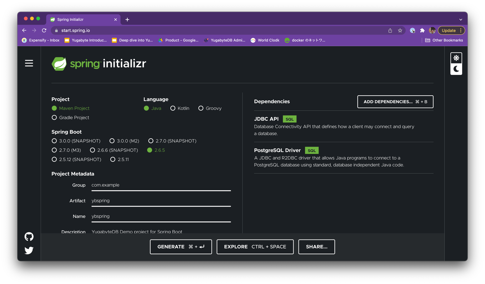

# Simple Spring Boot Application using JDBC API and PostgreSQL Driver


## References

- [Accessing Relational Data using JDBC with Spring](https://spring.io/guides/gs/relational-data-access/)

## DEMO

### Create Project

- https://start.spring.io/



### Import the Project to your IDE

### Copy the code from reference pages

### Modify some code 
- 
- `Customer.java`
  - getter, setterを追加
- `SpringApplication.java` (`RelationalDataAccessApplication.java`)
  - サンプルがH2用なので、一部PostgreSQL用に編集

```
        jdbcTemplate.execute("DROP TABLE customers IF EXISTS ");
```
- 編集後
```
        jdbcTemplate.execute("DROP TABLE IF EXISTS customers");
```

### データベースの接続情報を追加

`application.properties`

- デフォルトポートは5433
- `yugabyte`というデータベースがある

```
spring.datasource.url=jdbc:postgresql://127.0.0.1:5433/yugabyte
spring.datasource.username=yugabyte
spring.datasource.password=yugabyte
```

### 実行

```
/Library/Java/JavaVirtualMachines/zulu-11.jdk/Contents/Home/bin/java -agentlib:jdwp=transport=dt_socket,address=127.0.0.1:58129,suspend=y,server=n -XX:TieredStopAtLevel=1 -noverify -Dspring.output.ansi.enabled=always -javaagent:/Users/tichimura/Library/Caches/JetBrains/IntelliJIdea2021.2/captureAgent/debugger-agent.jar -Dcom.sun.management.jmxremote -Dspring.jmx.enabled=true -Dspring.liveBeansView.mbeanDomain -Dspring.application.admin.enabled=true -Dfile.encoding=UTF-8 -classpath /Users/tichimura/git/tichimura/ybspring/target/classes:/Users/tichimura/.m2/repository/org/springframework/boot/spring-boot-starter-jdbc/2.6.5/spring-boot-starter-jdbc-2.6.5.jar:/Users/tichimura/.m2/repository/org/springframework/boot/spring-boot-starter/2.6.5/spring-boot-starter-2.6.5.jar:/Users/tichimura/.m2/repository/org/springframework/boot/spring-boot/2.6.5/spring-boot-2.6.5.jar:/Users/tichimura/.m2/repository/org/springframework/spring-context/5.3.17/spring-context-5.3.17.jar:/Users/tichimura/.m2/repository/org/springframework/spring-aop/5.3.17/spring-aop-5.3.17.jar:/Users/tichimura/.m2/repository/org/springframework/spring-expression/5.3.17/spring-expression-5.3.17.jar:/Users/tichimura/.m2/repository/org/springframework/boot/spring-boot-autoconfigure/2.6.5/spring-boot-autoconfigure-2.6.5.jar:/Users/tichimura/.m2/repository/org/springframework/boot/spring-boot-starter-logging/2.6.5/spring-boot-starter-logging-2.6.5.jar:/Users/tichimura/.m2/repository/ch/qos/logback/logback-classic/1.2.11/logback-classic-1.2.11.jar:/Users/tichimura/.m2/repository/ch/qos/logback/logback-core/1.2.11/logback-core-1.2.11.jar:/Users/tichimura/.m2/repository/org/apache/logging/log4j/log4j-to-slf4j/2.17.2/log4j-to-slf4j-2.17.2.jar:/Users/tichimura/.m2/repository/org/apache/logging/log4j/log4j-api/2.17.2/log4j-api-2.17.2.jar:/Users/tichimura/.m2/repository/org/slf4j/jul-to-slf4j/1.7.36/jul-to-slf4j-1.7.36.jar:/Users/tichimura/.m2/repository/jakarta/annotation/jakarta.annotation-api/1.3.5/jakarta.annotation-api-1.3.5.jar:/Users/tichimura/.m2/repository/org/yaml/snakeyaml/1.29/snakeyaml-1.29.jar:/Users/tichimura/.m2/repository/com/zaxxer/HikariCP/4.0.3/HikariCP-4.0.3.jar:/Users/tichimura/.m2/repository/org/slf4j/slf4j-api/1.7.36/slf4j-api-1.7.36.jar:/Users/tichimura/.m2/repository/org/springframework/spring-jdbc/5.3.17/spring-jdbc-5.3.17.jar:/Users/tichimura/.m2/repository/org/springframework/spring-beans/5.3.17/spring-beans-5.3.17.jar:/Users/tichimura/.m2/repository/org/springframework/spring-tx/5.3.17/spring-tx-5.3.17.jar:/Users/tichimura/.m2/repository/org/postgresql/postgresql/42.3.3/postgresql-42.3.3.jar:/Users/tichimura/.m2/repository/org/checkerframework/checker-qual/3.5.0/checker-qual-3.5.0.jar:/Users/tichimura/.m2/repository/org/springframework/spring-core/5.3.17/spring-core-5.3.17.jar:/Users/tichimura/.m2/repository/org/springframework/spring-jcl/5.3.17/spring-jcl-5.3.17.jar:/Applications/IntelliJ IDEA.app/Contents/lib/idea_rt.jar com.example.ybspring.YbspringApplication
Connected to the target VM, address: '127.0.0.1:58129', transport: 'socket'

  .   ____          _            __ _ _
 /\\ / ___'_ __ _ _(_)_ __  __ _ \ \ \ \
( ( )\___ | '_ | '_| | '_ \/ _` | \ \ \ \
 \\/  ___)| |_)| | | | | || (_| |  ) ) ) )
  '  |____| .__|_| |_|_| |_\__, | / / / /
 =========|_|==============|___/=/_/_/_/
 :: Spring Boot ::                (v2.6.5)

2022-03-30 15:39:40.418  INFO 28725 --- [           main] c.example.ybspring.YbspringApplication   : Starting YbspringApplication using Java 11.0.13 on Tomohiros-MacBook-Pro.local with PID 28725 (/Users/tichimura/git/tichimura/ybspring/target/classes started by tichimura in /Users/tichimura/git/tichimura/ybspring)
2022-03-30 15:39:40.419  INFO 28725 --- [           main] c.example.ybspring.YbspringApplication   : No active profile set, falling back to 1 default profile: "default"
2022-03-30 15:39:40.763  INFO 28725 --- [           main] c.example.ybspring.YbspringApplication   : Started YbspringApplication in 0.522 seconds (JVM running for 0.883)
2022-03-30 15:39:40.764  INFO 28725 --- [           main] c.e.y.RelationalDataAccessApplication    : Creating tables
2022-03-30 15:39:40.765  INFO 28725 --- [           main] com.zaxxer.hikari.HikariDataSource       : HikariPool-1 - Starting...
2022-03-30 15:39:40.846  INFO 28725 --- [           main] com.zaxxer.hikari.HikariDataSource       : HikariPool-1 - Start completed.
2022-03-30 15:39:45.558  INFO 28725 --- [           main] c.e.y.RelationalDataAccessApplication    : Inserting customer record for John Woo
2022-03-30 15:39:45.559  INFO 28725 --- [           main] c.e.y.RelationalDataAccessApplication    : Inserting customer record for Jeff Dean
2022-03-30 15:39:45.559  INFO 28725 --- [           main] c.e.y.RelationalDataAccessApplication    : Inserting customer record for Josh Bloch
2022-03-30 15:39:45.559  INFO 28725 --- [           main] c.e.y.RelationalDataAccessApplication    : Inserting customer record for Josh Long
2022-03-30 15:39:45.585  INFO 28725 --- [           main] c.e.y.RelationalDataAccessApplication    : Querying for customer records where first_name = 'Josh':
2022-03-30 15:39:45.625  INFO 28725 --- [           main] c.e.y.RelationalDataAccessApplication    : Customer[id=4, firstName='Josh', lastName='Long']
2022-03-30 15:39:45.625  INFO 28725 --- [           main] c.e.y.RelationalDataAccessApplication    : Customer[id=3, firstName='Josh', lastName='Bloch']
2022-03-30 15:39:45.628  INFO 28725 --- [ionShutdownHook] com.zaxxer.hikari.HikariDataSource       : HikariPool-1 - Shutdown initiated...
2022-03-30 15:39:45.634  INFO 28725 --- [ionShutdownHook] com.zaxxer.hikari.HikariDataSource       : HikariPool-1 - Shutdown completed.
Disconnected from the target VM, address: '127.0.0.1:58129', transport: 'socket'

Process finished with exit code 0

```
